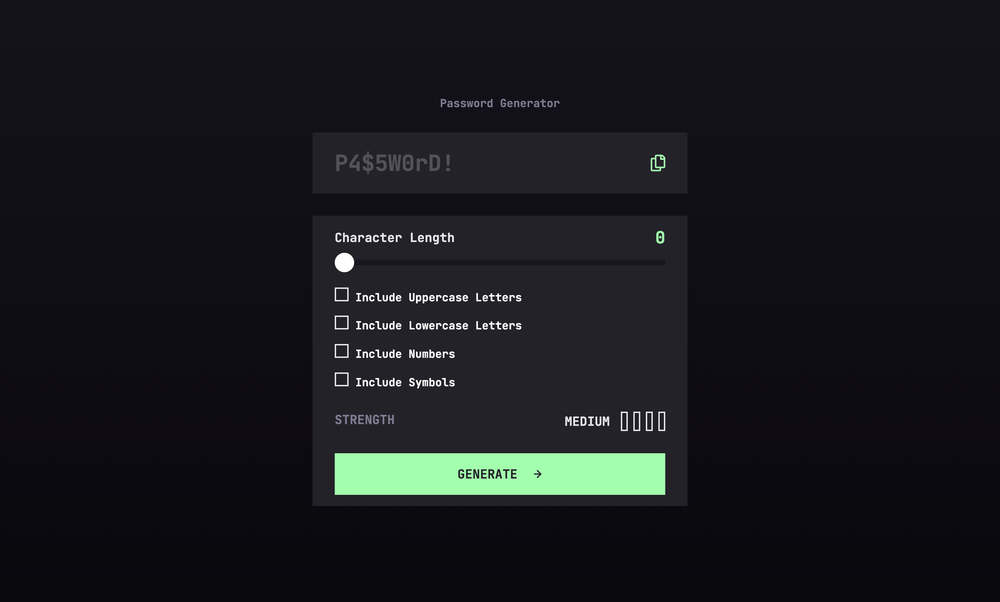

# Frontend Mentor - Password generator app solution

This is a solution to the [Password generator app challenge on Frontend Mentor](https://www.frontendmentor.io/challenges/password-generator-app-Mr8CLycqjh). Frontend Mentor challenges help you improve your coding skills by building realistic projects. 

## Table of contents

- [Overview](#overview)
  - [Screenshot](#screenshot)
  - [Links](#links)
- [My process](#my-process)
  - [Built with](#built-with)
  - [What I learned](#what-i-learned)

## Overview

### Screenshot

### Links

- Solution URL: [https://github.com/mariagraciaponce/password-generator-app](https://your-solution-url.com)
- Live Site URL: [https://mariagraciaponce.github.io/password-generator-app/e](https://your-live-site-url.com)

## My process

### Built with

- Semantic HTML5 markup
- CSS custom properties
- Flexbox
- CSS Grid
- Mobile-first workflow
- JavaScript

### What I learned

I learned that you cand add an SVG directly inline and style afterwards on CSS. I also learned the importance of selecting the right input types so the slider and the checkboxes actually work, the styling is a little bit tricky that way but it is worth it so that you don't have to use a lot of JS to make it work.

JS is still really hard, eveytime I think I know how to do something a new variable has to be created and I loose track all over again.
I asked a lot of questions to ChatGPT and in a way I feel like I'm being smart for using the technology in my favor but I also feel like I'm cheating so I don`t know.
